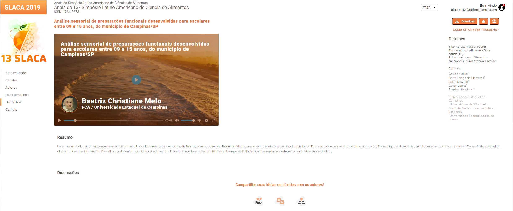

<h1 align="center">Chuva 🌧 - Teste Front-end</h1>


<p align="center">Slaca</p>

#

<p align="center">Aplicação WEB desenvolvida para o teste front-end 💧</p>

<br />



<br />

## O Projeto 🧾

Projeto desenvolvido para o teste front-end da Chuva. Não sabia muito bem o que colocar no nome da aplicação então deixei como Slaca que era o que mais chamava atenção no Figma do projeto. Como não tinha todas as telas com todos os casos e regras de negócios, tentei tratar os botões da melhor forma, para o usuário ter uma resposta visual do que estava acontecendo. Em questão de responsividade, o projeto não está o melhor mobile do mundo, mas está utilizável para qualquer dispositivo.

<br />

## Tecnologias 🔧

- React
- React Hooks
- TypeScript
- Styled-Components (CSS-IN-JS)
- Font-Awesome

<br />

## MockUP 🎨

Por ser um teste técnico, acho melhor não deixar disponível o figma do projeto. **Isso pode mudar posteriormente**.

<br />

## Utilização 👨🏼‍💻

- Clone esse repositório localmente com o comando: ```git clone https://github.com/hash-luk/chuva-test.git```
- Entre no diretório do projeto com o comando: ```cd chuva-test```
- Execute o comando: ```npm install```
- Execute o comando: ```npm start```
- Aplicativo aberto em: http://localhost:3000/

**Erros podem acontecer ao rodar o projeto, verifique as dependencias ou se está faltando algo**

<br />

## Deploy 🚀

Deploy do projeto na [Vercel](https://slaca.vercel.app)

<br />

## Finalização 🎉

Já desenvolvi várias aplicações front-end como se pode ver no meu github. Porém a cada uma tem um desafio diferente, neste caso foi simplesmente implementar a responsividade por ter muitos conteúdos que ao meu ver são importantes para o usuário. Mas é tudo é sempre um aprendizado e sei que dei meu melhor para o projeto.

#

<p align="center">Desenvolvido com 💜 por Lucas P.</p>


